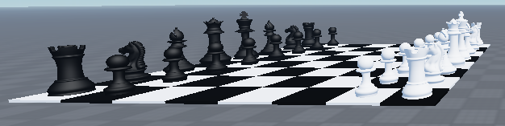

# Project Chess
An attempt for understanding what's happening behind online chess boards with Roblox Studio.

# 1. Overview

# 2. The System
The current system consists of 4 different scripts:

### 1. Client-side Handler (LocalScript)
Handles user inputs, requests and receives server-side data, and make client-side changes. Client-side changes include highlighting squares on the board that will only be visible for the intended player.

### 2. Game (match) Handler (Script)
The bridge between the client and the main system. Stores current game (match) state.

### 3. Board Handler (ModuleScript)
The core of the chess system. It is wrapped in a metatable as an Object-Oriented Programming (OOP), allowing to be run in different matches.

### 4. Renderer (ModuleScript)
The visualizer of the game. Similar to Board Handler, it is wrapped in a metatable as OOP. Contains methods for creating and updating board positions.

*Plan: Transform Game Handler into ModuleScript and add another script: __MainScript__ as a bridge between client and game.

Flow Example 1:
  1. Player clicks on a chess piece
  2. Client registers User Mouse Input
  3. Client requests available legal moves for the corresponding piece to Game Handler
  4. Game Handler sends the request to Board Handler
  5. Board Handler passes the information of legal moves to Game Handler, and finally to Client
  6. Client highlights the legal squares
